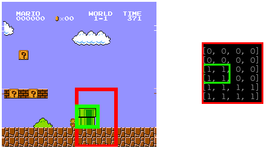

# PyNEAT
A small experiment where HyperNEat is used to create a neuronal network to play Super Mario Bros.


## How it works
This implementation uses the block buffer of Super Mario Bros. to create inputs based on Marios "sight".



## How to use
This has only been tested on Linux machines. Feel free to port it.

If you're using 64 bit Linux with installed liballegro, you can just run the examples. 

Otherwise you need to install libalegro5, compile my small abstraction lib [libnesfrontend](http://github.com/rugo/libnesfrontend) and a libretro NES core, preferably [QuickNES](https://github.com/libretro/QuickNES_Core). This is described on the [libnesfrontend](http://github.com/rugo/libnesfrontend) page. 

Compile them and copy them into the ``clibs`` folder:

```bash
cp libretro_quicknes.so gaming/clibs/libretrones.so
cp libnesfrontend.so gaming/clibs/
```

Make sure the libretro library (here QuickNES) is called ``libretrones.so``.

If you want to use this on windows, you have to change the ``emulator.NES`` class to use a [DLL instead](https://docs.python.org/3/library/ctypes.html#loading-dynamic-link-libraries).